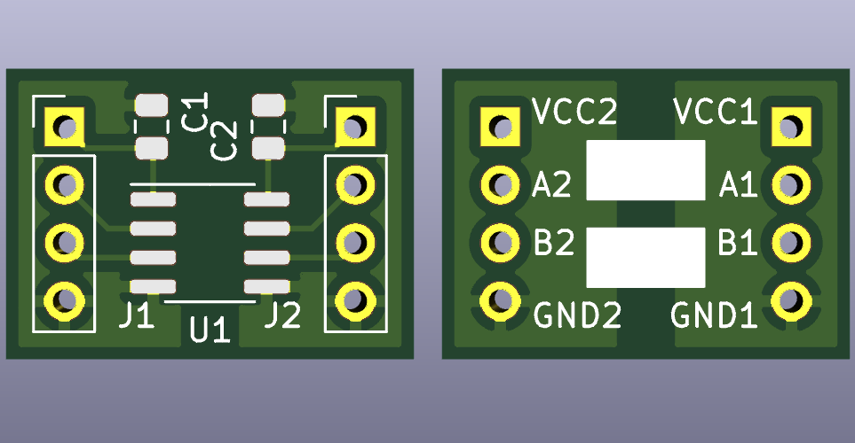

# Dual serial isolator

Small board design for a single MAX12930/MAX12931 isolator chip.

Since the MAX12930 and MAX12931 have a similar pin-out, a single board can be
used to expose their input and output pins. The spacing of the board's pin rows
is chosen such that the board can easily be mounted on a breadboard.

The back side of the board has two areas you can use to indicate in which
direction the signals can go, depending on which chip you used to populate the
board with.

Note that there is no reverse voltage protection included, so always pay
attention when hooking up VCC/GND.

